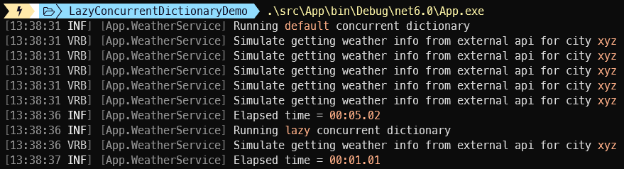

[](https://github.com/aimenux/LazyConcurrentDictionaryDemo/actions/workflows/ci.yml)

# LazyConcurrentDictionaryDemo
```
Using lazy concurrent dictionary to ensure thread safety for unsafe methods
```

> *ConcurrentDictionary<TKey,TValue> provides several methods for adding or updating key/value pairs in the dictionary. All these operations are atomic and are thread-safe with regards to all other operations on this class. The only exceptions are the methods that accept a delegate, that is, GetOrAdd and AddOrUpdate.*
>

In this repo, i m comparing 2 implementations (default one versus lazy one) of concurrent dictionary when dealing with methods like [GetOrAdd](https://learn.microsoft.com/en-us/dotnet/api/system.collections.concurrent.concurrentdictionary-2.getoradd) or [AddOrUpdate](https://learn.microsoft.com/en-us/dotnet/api/system.collections.concurrent.concurrentdictionary-2.addorupdate) :
>
> - `DefaultConcurrentDictionary` : use default implementation of concurrent dictionary, methods like `GetOrAdd` or `AddOrUpdate` are not thread safe (see [link](https://learn.microsoft.com/en-us/dotnet/api/system.collections.concurrent.concurrentdictionary-2?redirectedfrom=MSDN&view=net-7.0#remarks))
>
> - `LazyConcurrentDictionary` : use custom implementation (run once, lazy-loading) of concurrent dictionary, methods like `GetOrAdd` or `AddOrUpdate` are thread safe (see [link](https://andrewlock.net/making-getoradd-on-concurrentdictionary-thread-safe-using-lazy/))
>
> 
>

**`Tools`** : vs22, net 6.0
